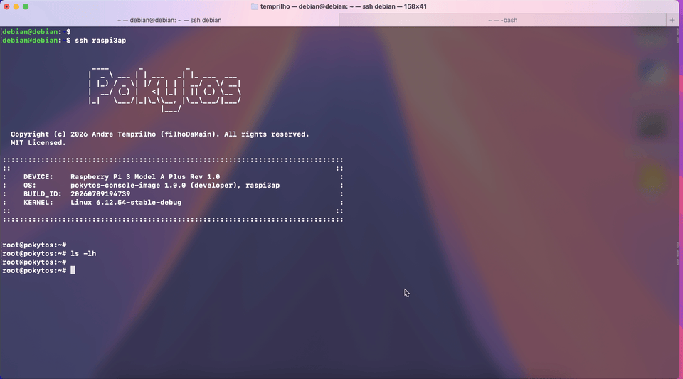

# Example of remote debugging using VS Code



This repo serves just as an example of how to embed [vscode_remote_debug](https://github.com/filhoDaMain/vscode_remote_debug) into an existing project to configure **VS Code for remote debugging**.

- [vscode_remote_debug](https://github.com/filhoDaMain/vscode_remote_debug) was cloned into `.vscode/`
- `.vscode/ENV` was configured for this project


## Quick Reference

**NOTE:** Change `ENV_TARGET_SSH_HOST` and `ENV_TARGET_IPADDR` with your ssh target and target's hostname respectively.

### Cross-compile
Build application and libraries
```Bash
# Source the 'SDK' to cross-compile for the remote target
# E.g.:
$ source /opt/pokytos/1.0.0/environment-setup-cortexa7t2hf-neon-vfpv4-poky-linux-gnueabi

# Build with debug symbols
$ make BUILD=debug
```

### Start debug session
`Run and Debug` > `Start Debugging: Launch (remote)`

Application and libraries are uploaded to remote target and debug session begins.